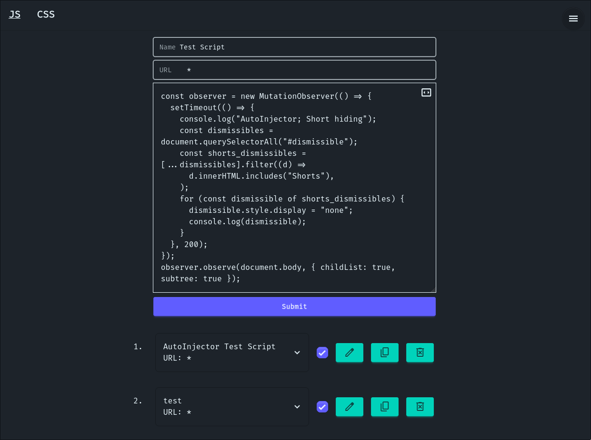

#  AutoInjector 

Automatic injection of scripts and CSS into websites

## Features

- Scripts and user CSS injection
- Add, edit, and delete scripts using a built-in script's dashboard
- Limiting of injection to specific target URLs or use fuzzy matching with `*`
- Enabling and disabling of script/user CSS
- Control over script injection parameter `injectImmediately`
- Simple script editor with:
	- Tab insertion on Tab key press
	- Removal of the last indent on Shift+Tab
	- Auto-indent
- Error collection system
- Errors can be sorted by date, script name, or URL
- Error forwarding with the use of `autoInjectorLogError(e)` function
- Trusted Types support
- Importing and Exporting
- Duplicate script/CSS detection system

## Preview

</img>
</img>

## Roadmap:
- [userScripts](https://developer.mozilla.org/en-US/docs/Mozilla/Add-ons/WebExtensions/API/userScripts) - for script injection on websites that have strict 

## Building

[Devbox](https://www.jetify.com/devbox) is chosen because it guarantees a consistent development environment.

- Clone the repository and run `devbox install` - set up the project environment.
- To build the extension `dist/` directory run:  
  ```sh
  devbox run build
  ```

## Install

### Firefox

The extension is not published on the Firefox Add-ons.

To install download the latest `.xpi` file from the [releases](../../releases) page.

In Firefox, open `about:addons` -> `Install Add‑on From File...` and select the downloaded `.xpi`.

### Chromium‑based browsers

The extension is not distributed Chromium‑based browsers. 

To install first build the extension.

To install temporarily:
 - Open `chrome://extensions/`
 - Enable `Developer mode`
 - Click `Load unpacked` and choose the `dist/` folder

 To install permanently:
 - Open `chrome://extensions/`
 - Enable `Developer mode`
 - Click `Pack extension` and choose the `dist/` folder
 - Drag-and-drop crated `.crx` file onto the `chrome://extensions` page

## License

This project is licensed under [MIT](LICENSE) License.
